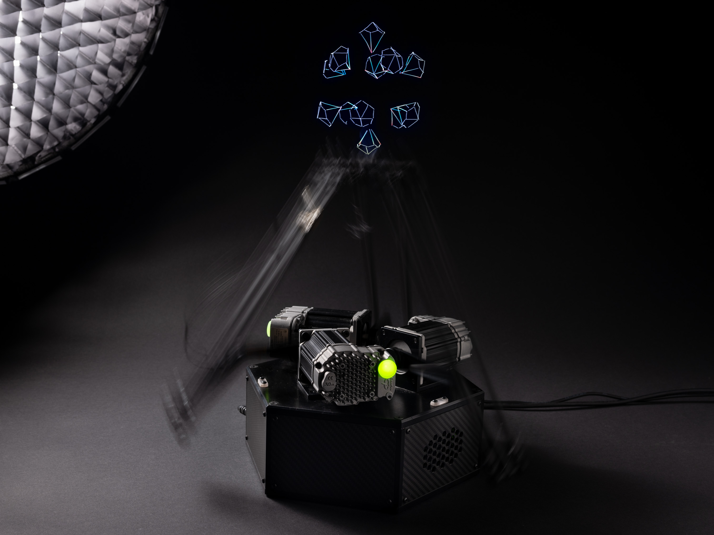
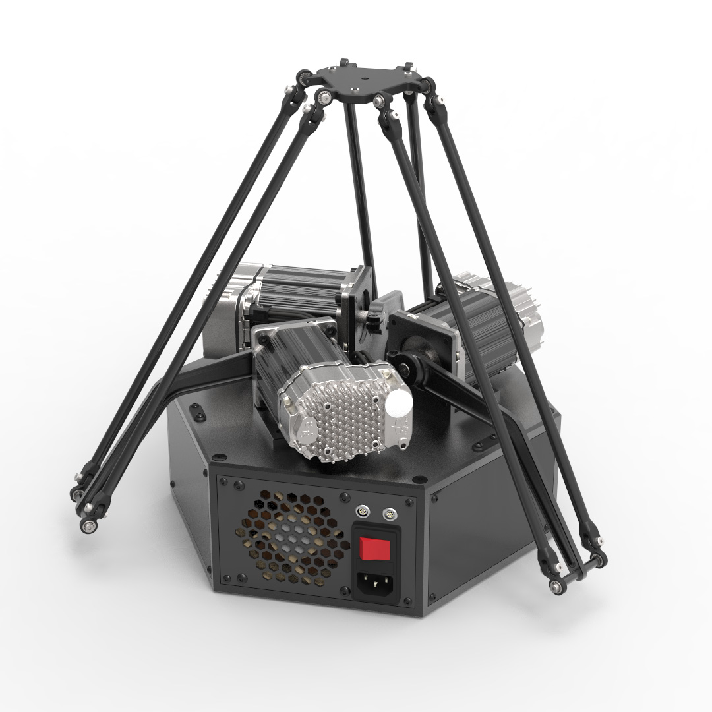
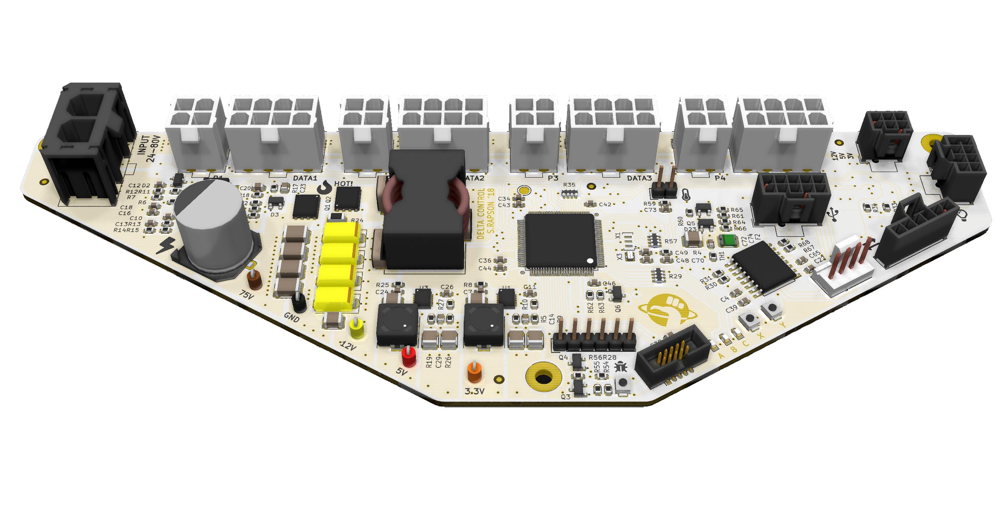
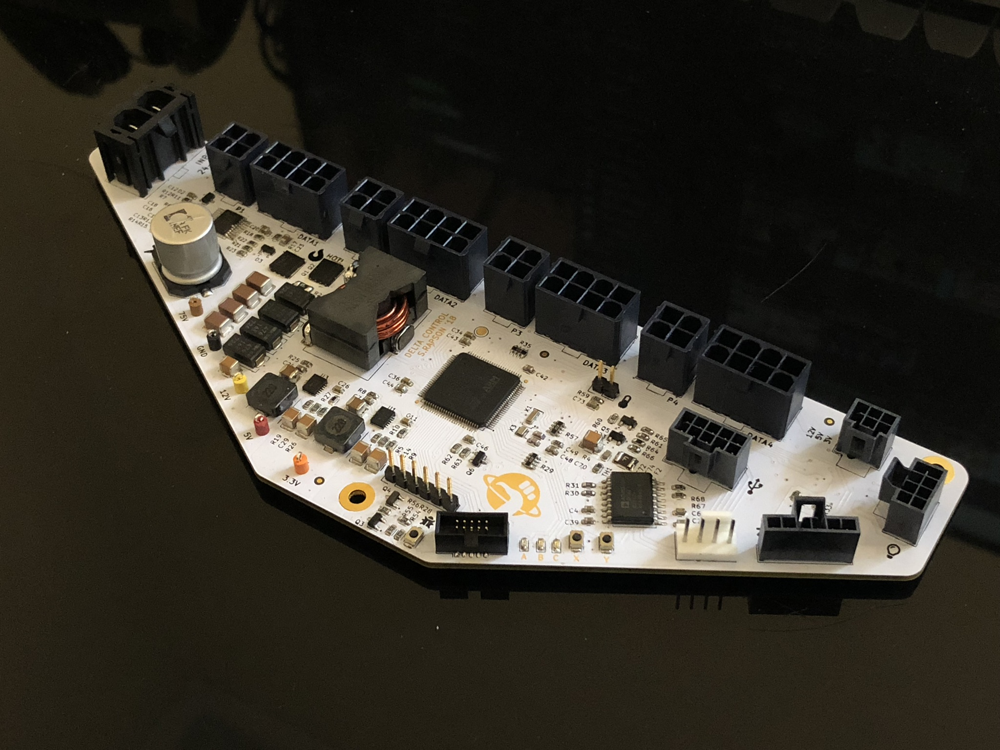
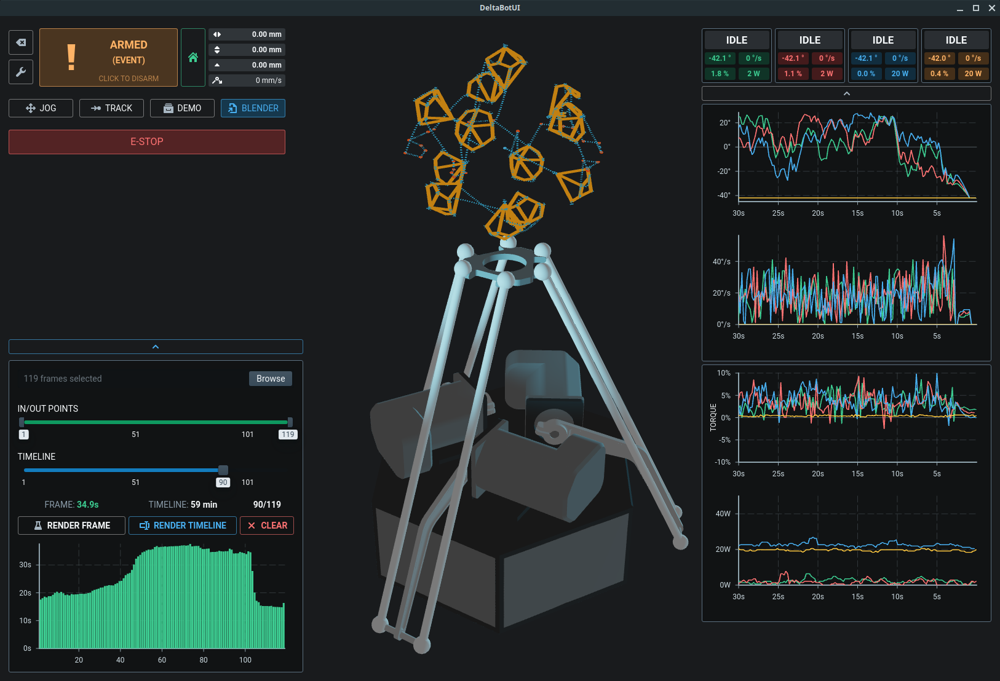
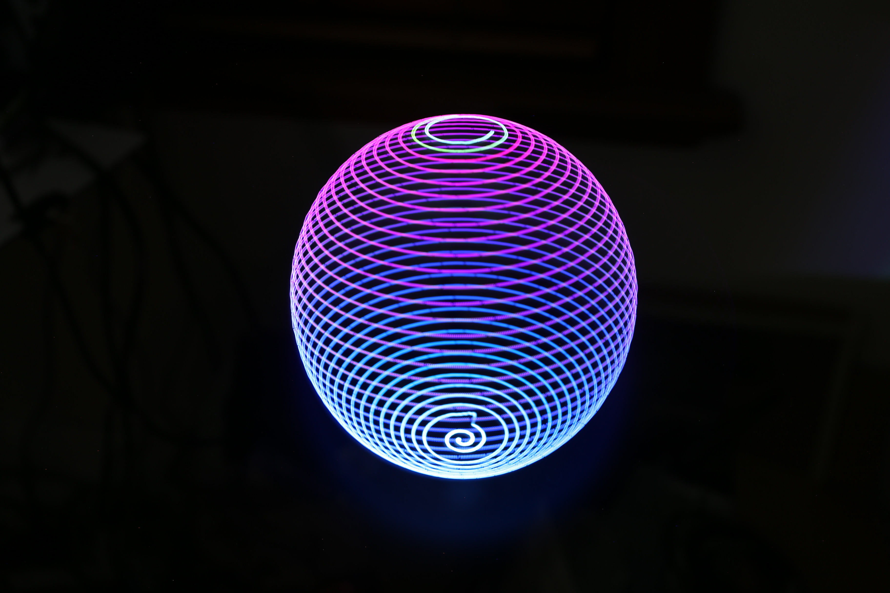
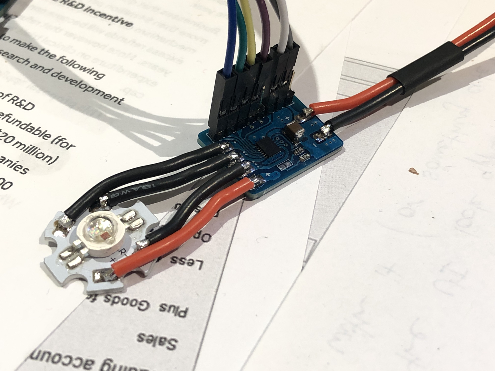
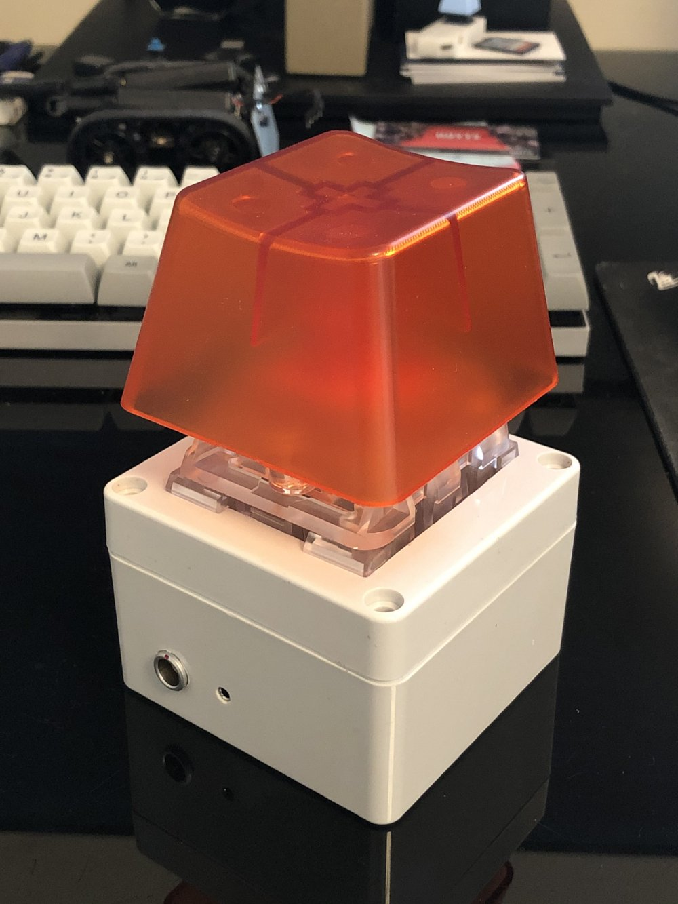

# ZaphodBot Lightpainting Robot

ZaphodBot is a DIY, 'high-end' rotary delta robot designed primarily for high-fidelity light painting.

It's served as a personal project where the majority of mechanics, electronics, firmware and higher level software has been designed from scratch (because why not).

I've detailed the design motivation and build in a more [longform post here](https://electricui.com/blog/delta-bot).

## Mechanics

CAD files for the robot are in Solidworks 2015 format, and can be found in `/mechanical/design/`.

The power supply and main electronics stacks live inside the hexagonal structure which forms the base, with servos mounted on top, connected directly to the arms.

To manufacture parts, see `/mechanical/design/manf_outputs/`  for drawings, STEP/DXF files. SLA 3D printing was used for joints, and CNC machining for the aluminium parts and carbon plates. 

All fasteners are standard metric hex bolts, with the exception of some bottom mounting holes which are 1/4in and 3/8in threaded holes to suit typical camera tripods.

## Electronics

The PCB was designed using KiCAD 5, located in `electronics/zaphod-controller`. Gerber outputs are available with BoM, but minor design revisions are needed to improve wire-loom layout and debug/expansion connector positions. 

It's based on a STM32F4 processor, provides regulated 3/5/12V from the 75V system supply, and manages the servos, internal IO and external IO.

- Power input (75V from Teknic IPC) through 2-pin MOLEX SABRE connector.
- Clearpath servo motors connect with 8-pin MOLEX MicroFit for signalling, and 4-pin MicroFit for 75V supply.
- Internal IO NanoFit connectors provide PWM fan support, UART, I2C, 2x ADC/DAC, and PWM. These can also be used as generic IO. See  `/electronics/zaphod-controller/Outputs/zaphod-controller-sch.pdf` for pinouts.
- Internal IO 2.54mm header strip provides switchable+fused 3.3V and USART, intended for wireless comms backpack in the future (likely ESP32 flavoured).
- The 9-pin LEMO connector used for external expansion provides galvanically isolated USB and 4 isolated IO lines (2 inputs, 2 outputs). Pinout in `/docs/connectors_pinouts.md`.
- The 7-pin LEMO connector supports a 4th Clearpath SD series servo, intended for use with rotating or linear stages. Pinout in `/docs/connectors_pinouts.md.`

## Firmware

Microcontroller firmware (STM32) is in `/firmware`, is written in C, and can be built with a fairly standard `arm-gcc-eabi-none` toolchain.

I've used (and included config for) CLion as my main IDE, which is CMake based, though building with SW4/Eclipse shouldn't be too hard either.

Flashing the microcontroller is pretty standard as well, a 10-pin ARM CORTEX SWD socket is on the PCB, which connects to a STLink, Blackmagic Probe, or JLink programmer (used all three at various stages of this project).

# User Interface

The user interface is built with [Electric UI](https://electricui.com/install), and can be built and run by invoking `arc start` from `/interface`. 

It facilitates control and monitoring of the hardware, along with toolpath generation, optimisation and visualisation pipelines.

## Toolpath Generation

Toolpaths for lightpainting are created by exporting spline data from [Blender using a Python script](https://github.com/Mike-Dax/total-perspective-vortex/), and loading the output with the "Blender" tab in the UI.

The frontend UI is responsible for parsing the Blender scene and performing a series of move planning and TSP optimisation steps to reduce render times.

# Accessories

## Light Painting

The light-painting 'brush' uses acrylic 1mm core fibre, connected to a 3x3W RGB LED.

The fibre is mounted to the effector with a turned acetal stalk (not documented), or with one of the SLA printed mounts found in `/mechanical/fibre-couplers/`.

The driver PCB is in `/electronics/rgb-led-board/` along with manufacturing files and a simple Arduino test program. This board connects to `zaphod-controller` via the 8-pin NanoFit connector, which provides PWM+IO and power.

## External E-STOP + IO Breakout Box

The 9-pin LEMO connector is used with a 2m cable, connecting to the breakout box via matching 9-pin LEMO. A [Novelkeys Big Switch](https://novelkeys.xyz/products/the-big-switch-series) is used as an E-STOP, with the keyswitch light indicating motor state.

A 2.5mm stereo socket mounted in the box provides support for camera shutter release cable, in this case for a Canon N3 connector.